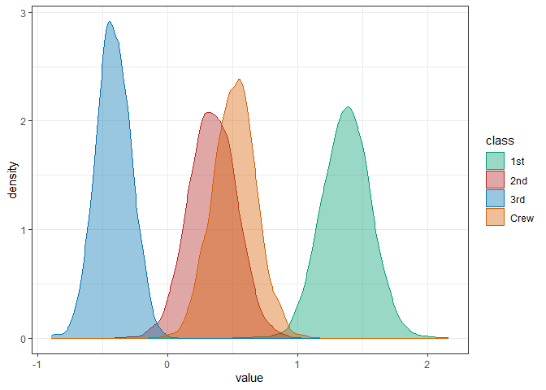

<!-- README.md is generated from README.Rmd. Please edit that file -->

# faintr

<!-- badges: start -->

[](https://github.com/michael-franke/faintr/actions)
[](https://app.codecov.io/gh/michael-franke/faintr?branch=main)
<!-- badges: end -->

The **faintr** (FActorINTerpreteR) package provides convenience
functions for interpreting [brms](https://github.com/paul-buerkner/brms)
model fits for data from factorial designs. It allows for the extraction
and comparison of posterior draws for a given design cell, irrespective
of the encoding scheme used in the model.

Currently, **faintr** provides the following functions:

-   `get_cell_definitions` returns information on the models’ predictor
    variables and how they are encoded in the model.
-   `extract_cell_draws` returns posterior draws for one subset of
    design cells.
-   `compare_groups` returns summary statistics of comparing two subsets
    of design cells.

## Installation

You can install the development version from GitHub with:

``` r
# install.packages("devtools")
devtools::install_github("michael-franke/faintr")
```

## Examples

In this section, we shortly introduce how to use the package. For a more
detailed overview, please refer to the vignette.

We will use a preprocessed version of R’s built-in Titanic data set:

    #> # A tibble: 16 x 5
    #>    Class Sex    Age   Count Total
    #>    <chr> <chr>  <chr> <dbl> <dbl>
    #>  1 1st   Male   Child     5     5
    #>  2 2nd   Male   Child    11    11
    #>  3 3rd   Male   Child    13    48
    #>  4 Crew  Male   Child     0     0
    #>  5 1st   Female Child     1     1
    #>  6 2nd   Female Child    13    13
    #>  7 3rd   Female Child    14    31
    #>  8 Crew  Female Child     0     0
    #>  9 1st   Male   Adult    57   175
    #> 10 2nd   Male   Adult    14   168
    #> 11 3rd   Male   Adult    75   462
    #> 12 Crew  Male   Adult   192   862
    #> 13 1st   Female Adult   140   144
    #> 14 2nd   Female Adult    80    93
    #> 15 3rd   Female Adult    76   165
    #> 16 Crew  Female Adult    20    23

The data set contains the following variables:

-   `Class`: Passenger class
-   `Sex`: Sex of the passenger
-   `Age`: Age group of the passenger
-   `Count`: Count of passengers who survived
-   `Total`: Total number of passengers

Below, we regress the counts of passengers who survived as a function of
their class, sex, and age group using a Binomial logistic regression
model fitted with `brms`:

``` r
fit <- brm(Count | trials(Total) ~ Class + Sex + Age,  
           data = data, 
           family = binomial(link = "logit"),
           seed = 123)
```

``` r
summary(fit)
#>  Family: binomial 
#>   Links: mu = logit 
#> Formula: Count | trials(Total) ~ Class + Sex + Age 
#>    Data: data (Number of observations: 16) 
#>   Draws: 4 chains, each with iter = 2000; warmup = 1000; thin = 1;
#>          total post-warmup draws = 4000
#> 
#> Population-Level Effects: 
#>           Estimate Est.Error l-95% CI u-95% CI Rhat Bulk_ESS Tail_ESS
#> Intercept     2.06      0.17     1.73     2.40 1.00     2567     2451
#> Class2nd     -1.03      0.20    -1.42    -0.64 1.00     2587     2868
#> Class3rd     -1.79      0.17    -2.13    -1.45 1.00     2522     2357
#> ClassCrew    -0.86      0.16    -1.16    -0.56 1.00     2541     2651
#> SexMale      -2.43      0.14    -2.71    -2.16 1.00     3094     2611
#> AgeChild      1.07      0.25     0.57     1.56 1.00     2086     2332
#> 
#> Draws were sampled using sampling(NUTS). For each parameter, Bulk_ESS
#> and Tail_ESS are effective sample size measures, and Rhat is the potential
#> scale reduction factor on split chains (at convergence, Rhat = 1).
```

To obtain information on the factors and the encoding scheme used in the
model, we can use `get_cell_definitions`:

``` r
get_cell_definitions(fit)
#> # A tibble: 16 x 10
#>     cell Class Sex    Age   Intercept Class2nd Class3rd ClassCrew SexMale
#>    <int> <chr> <chr>  <chr>     <dbl>    <dbl>    <dbl>     <dbl>   <dbl>
#>  1     1 1st   Male   Child         1        0        0         0       1
#>  2     2 2nd   Male   Child         1        1        0         0       1
#>  3     3 3rd   Male   Child         1        0        1         0       1
#>  4     4 Crew  Male   Child         1        0        0         1       1
#>  5     5 1st   Female Child         1        0        0         0       0
#>  6     6 2nd   Female Child         1        1        0         0       0
#>  7     7 3rd   Female Child         1        0        1         0       0
#>  8     8 Crew  Female Child         1        0        0         1       0
#>  9     9 1st   Male   Adult         1        0        0         0       1
#> 10    10 2nd   Male   Adult         1        1        0         0       1
#> 11    11 3rd   Male   Adult         1        0        1         0       1
#> 12    12 Crew  Male   Adult         1        0        0         1       1
#> 13    13 1st   Female Adult         1        0        0         0       0
#> 14    14 2nd   Female Adult         1        1        0         0       0
#> 15    15 3rd   Female Adult         1        0        1         0       0
#> 16    16 Crew  Female Adult         1        0        0         1       0
#> # ... with 1 more variable: AgeChild <dbl>
```

The output reveals that we used dummy coding for factors `Class`, `Sex`
and `Age`, where `1st`, `Female`, and `Adult` are the reference levels,
respectively.

To obtain posterior draws for a specific design cell, we can use
`extract_cell_definitions`. For instance, draws for women in the 2nd
class can be extracted like so:

``` r
extract_cell_draws(fit, Sex == "Female" & Class == "2nd" & Age == "Adult") %>% 
  head()
#>       draws
#> 1 0.9186060
#> 2 0.7869500
#> 3 1.1521478
#> 4 0.9583188
#> 5 0.9401332
#> 6 1.1401008
```

Parameter `colname` allows changing the default column name in the
output, which facilitates post-processing of cell draws, e.g., for
plotting or summary statistics. Here, we extract the draws for each
level of `Class` (averaged over `Sex` and `Age`) and visualize the
results:

``` r
draws_1st  <- extract_cell_draws(fit, Class == "1st", colname = "1st")
draws_2nd  <- extract_cell_draws(fit, Class == "2nd", colname = "2nd")
draws_3rd  <- extract_cell_draws(fit, Class == "3rd", colname = "3rd")
draws_crew <- extract_cell_draws(fit, Class == "Crew", colname = "Crew")

draws_class <- tibble(draws_1st, draws_2nd, draws_3rd, draws_crew) %>% 
  pivot_longer(cols = everything(), names_to = "class", values_to = "draws")

draws_class %>% 
  ggplot(aes(x = draws, color = class, fill = class)) +
  geom_density(alpha = 0.4)
```

 Finally, we can
compare two subsets of design cells with `compare_groups`. Here, we
compare the odds of surviving between female passengers in the first
class with male passengers in all but the first class:

``` r
compare_groups(fit, 
               Sex == "Female" & Class == "1st",
               Sex == "Male" & Class != "1st"
               )
#> Outcome of comparing groups: 
#>  * higher:  Sex == "Female" & Class == "1st" 
#>  * lower:   Sex == "Male" & Class != "1st" 
#> Mean 'higher - lower':  3.66 
#> 95% HDI:  [ 3.246 ; 4.045 ]
#> P('higher - lower' > 0):  1 
#> Posterior odds:  Inf
```

If one of two group specifications is left out, we compare against the
grand mean:

``` r
compare_groups(fit, 
               Class == "Crew"
               )
#> Outcome of comparing groups: 
#>  * higher:  Class == "Crew" 
#>  * lower:   grand mean 
#> Mean 'higher - lower':  0.05887 
#> 95% HDI:  [ -0.1276 ; 0.2246 ]
#> P('higher - lower' > 0):  0.7482 
#> Posterior odds:  2.972
```
