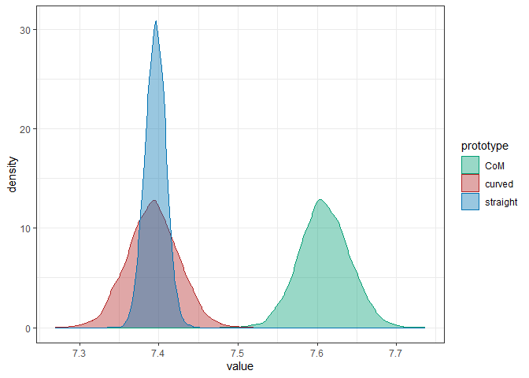

<!-- README.md is generated from README.Rmd. Please edit that file -->

# faintr 

<!-- badges: start -->

[](https://github.com/michael-franke/faintr/actions)
[](https://app.codecov.io/gh/michael-franke/faintr?branch=main)
<!-- badges: end -->

## Overview

The **faintr** (FActorINTerpreteR) package provides convenience
functions for interpreting
[**brms**](https://paul-buerkner.github.io/brms/) model fits for data
from factorial designs. It allows for the extraction and comparison of
posterior draws for a given design cell, irrespective of the encoding
scheme used in the model.

Currently, **faintr** provides the following functions:

- `get_cell_definitions` returns information on the predictor variables
  and how they are encoded in the model.
- `extract_cell_draws` returns posterior draws and additional metadata
  for all design cells.
- `filter_cell_draws` returns posterior draws and additional metadata
  for one subset of design cells.
- `compare_groups` returns summary statistics of comparing two subsets
  of design cells.

## Installation

You can install the development version from GitHub with:

``` r
# install.packages("devtools")
devtools::install_github("michael-franke/faintr")
```

## Examples

In this section, we shortly introduce how to use the package. For a more
detailed overview, please refer to the
[vignette](https://michael-franke.github.io/faintr/articles/faintr_basics.html).

We will use a preprocessed version of the mouse-tracking data set from
the [**aida**](https://github.com/michael-franke/aida-package) package:

``` r
data %>% 
  select(RT, group, condition, prototype_label) %>%
  head()
#> # A tibble: 6 x 4
#>      RT group condition prototype_label
#>   <dbl> <chr> <chr>     <fct>          
#> 1   950 touch Atypical  straight       
#> 2  1251 touch Typical   straight       
#> 3   930 touch Atypical  curved         
#> 4   690 touch Atypical  curved         
#> 5   951 touch Typical   CoM            
#> 6  1079 touch Atypical  CoM
```

The variables relevant for us are:

- `RT`: Reaction time in milliseconds
- `group`: Whether a category is selected by click vs touch
- `condition`: Whether the animal is a typical vs atypical
  representative of its category
- `prototype_label`: The type of prototypical movement strategy
  (straight vs curved vs CoM)

Below, we regress the log-transformed reaction times as a function of
factors `group`, `condition`, `prototype_label`, and their three-way
interaction using a linear regression model fitted with
[**brms**](https://paul-buerkner.github.io/brms/):

``` r
fit <- brms::brm(formula = log(RT) ~ group * condition * prototype_label,
                 data = data,
                 seed = 123
                 )
```

To obtain information on the factors and the coding scheme used in the
model, we can use `get_cell_definitions`:

``` r
get_cell_definitions(fit)
#> # A tibble: 12 x 16
#>     cell group condition prototype_label Intercept grouptouch conditionTypical
#>    <int> <chr> <chr>     <fct>               <dbl>      <dbl>            <dbl>
#>  1     1 touch Atypical  straight                1          1                0
#>  2     2 touch Typical   straight                1          1                1
#>  3     3 touch Atypical  curved                  1          1                0
#>  4     4 touch Typical   CoM                     1          1                1
#>  5     5 touch Atypical  CoM                     1          1                0
#>  6     6 touch Typical   curved                  1          1                1
#>  7     7 click Atypical  straight                1          0                0
#>  8     8 click Typical   straight                1          0                1
#>  9     9 click Typical   curved                  1          0                1
#> 10    10 click Atypical  CoM                     1          0                0
#> 11    11 click Typical   CoM                     1          0                1
#> 12    12 click Atypical  curved                  1          0                0
#> # ... with 9 more variables: prototype_labelcurved <dbl>,
#> #   prototype_labelCoM <dbl>, `grouptouch:conditionTypical` <dbl>,
#> #   `grouptouch:prototype_labelcurved` <dbl>,
#> #   `grouptouch:prototype_labelCoM` <dbl>,
#> #   `conditionTypical:prototype_labelcurved` <dbl>,
#> #   `conditionTypical:prototype_labelCoM` <dbl>,
#> #   `grouptouch:conditionTypical:prototype_labelcurved` <dbl>, ...
```

The output shows that factors `group`, `condition` and `prototype_label`
are dummy-coded, with `click`, `Atypical`, and `straight` being the
reference levels, respectively.

To extract posterior draws for all design cells, we can use
`extract_cell_draws`:

``` r
extract_cell_draws(fit)
#> # A draws_df: 1000 iterations, 4 chains, and 12 variables
#>    touch:Atypical:straight touch:Typical:straight touch:Atypical:curved
#> 1                      7.4                    7.2                   7.5
#> 2                      7.4                    7.2                   7.4
#> 3                      7.4                    7.2                   7.5
#> 4                      7.4                    7.1                   7.4
#> 5                      7.4                    7.2                   7.6
#> 6                      7.4                    7.2                   7.4
#> 7                      7.4                    7.2                   7.5
#> 8                      7.4                    7.2                   7.5
#> 9                      7.4                    7.2                   7.4
#> 10                     7.4                    7.2                   7.5
#>    touch:Typical:CoM touch:Atypical:CoM touch:Typical:curved
#> 1                7.6                7.6                  7.2
#> 2                7.5                7.6                  7.1
#> 3                7.5                7.6                  7.1
#> 4                7.4                7.7                  7.1
#> 5                7.5                7.4                  7.1
#> 6                7.5                7.5                  7.1
#> 7                7.4                7.7                  7.2
#> 8                7.4                7.6                  7.1
#> 9                7.5                7.7                  7.2
#> 10               7.5                7.6                  7.2
#>    click:Atypical:straight click:Typical:straight
#> 1                      7.6                    7.4
#> 2                      7.6                    7.4
#> 3                      7.6                    7.4
#> 4                      7.6                    7.4
#> 5                      7.6                    7.4
#> 6                      7.6                    7.4
#> 7                      7.7                    7.4
#> 8                      7.7                    7.4
#> 9                      7.6                    7.4
#> 10                     7.6                    7.4
#> # ... with 3990 more draws, and 4 more variables
#> # ... hidden reserved variables {'.chain', '.iteration', '.draw'}
```

With `filter_cell_draws` we can obtain posterior draws for a specific
design cell. For instance, draws for typical exemplars in click trials,
averaged over factor `prototype_label`, can be extracted like so:

``` r
filter_cell_draws(fit, condition == "Typical" & group == "click")
#> # A draws_df: 1000 iterations, 4 chains, and 1 variables
#>    draws
#> 1    7.4
#> 2    7.4
#> 3    7.5
#> 4    7.5
#> 5    7.5
#> 6    7.4
#> 7    7.5
#> 8    7.4
#> 9    7.4
#> 10   7.5
#> # ... with 3990 more draws
#> # ... hidden reserved variables {'.chain', '.iteration', '.draw'}
```

Parameter `colname` allows changing the default column name in the
output, which facilitates post-processing of cell draws, e.g., for
plotting or summary statistics. Here, we extract the draws for each
level of `prototype_label` (averaged over `group` and `condition`) and
visualize the results:

``` r
draws_straight <- filter_cell_draws(fit, prototype_label == "straight", colname = "straight")
draws_curved <- filter_cell_draws(fit, prototype_label == "curved", colname = "curved")
draws_CoM <- filter_cell_draws(fit, prototype_label == "CoM", colname = "CoM")

draws_prototype <- posterior::bind_draws(draws_straight, draws_curved, draws_CoM) %>%
  pivot_longer(cols = posterior::variables(.), names_to = "prototype", values_to = "value")

draws_prototype %>%
  ggplot(aes(x = value, color = prototype, fill = prototype)) +
  geom_density(alpha = 0.4)
```



Finally, we can compare two subsets of design cells with
`compare_groups`. Here, we compare the estimates for atypical exemplars
in click trials against typical exemplars in click trials (averaged over
the three prototypical movement strategies):

``` r
compare_groups(fit,
               higher = condition == "Atypical" & group == "click",
               lower = condition == "Typical" & group == "click"
               )
#> Outcome of comparing groups: 
#>  * higher:  condition == "Atypical" & group == "click" 
#>  * lower:   condition == "Typical" & group == "click" 
#> Mean 'higher - lower':  0.2215 
#> 95% HDI:  [ 0.1421 ; 0.2978 ]
#> P('higher - lower' > 0):  1 
#> Posterior odds:  Inf
```

If one of two group specifications is left out, we compare against the
grand mean:

``` r
compare_groups(fit,
               higher = group == "click"
               )
#> Outcome of comparing groups: 
#>  * higher:  group == "click" 
#>  * lower:   grand mean 
#> Mean 'higher - lower':  0.1009 
#> 95% HDI:  [ 0.06956 ; 0.1302 ]
#> P('higher - lower' > 0):  1 
#> Posterior odds:  Inf
```

If the Boolean flag `include_bf` is set to `TRUE` (default is `FALSE`),
Bayes Factors for the inequality (higher \> lower) are approximated in
comparison to the “negated hypothesis” (lower \<= higher). However, this
requires specifying proper priors for all parameters:

``` r
fit_with_priors <- brms::brm(formula = log(RT) ~ group * condition * prototype_label,
                             prior = prior(student_t(1, 0, 3), class = "b"),
                             data = data,
                             seed = 123
                             )
```

``` r
compare_groups(fit_with_priors,
               higher = prototype_label != "straight",
               lower = prototype_label == "straight",
               include_bf = TRUE
               )
#> Outcome of comparing groups: 
#>  * higher:  prototype_label != "straight" 
#>  * lower:   prototype_label == "straight" 
#> Mean 'higher - lower':  0.1062 
#> 95% HDI:  [ 0.05464 ; 0.1547 ]
#> P('higher - lower' > 0):  0.9998 
#> Posterior odds:  3999 
#> Bayes factor:  4015
```
